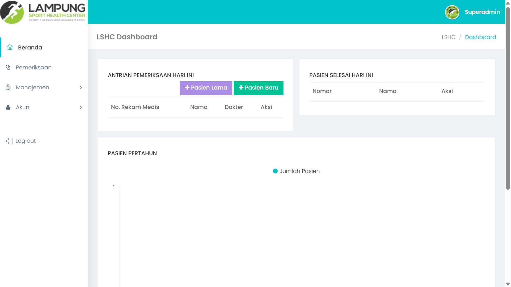
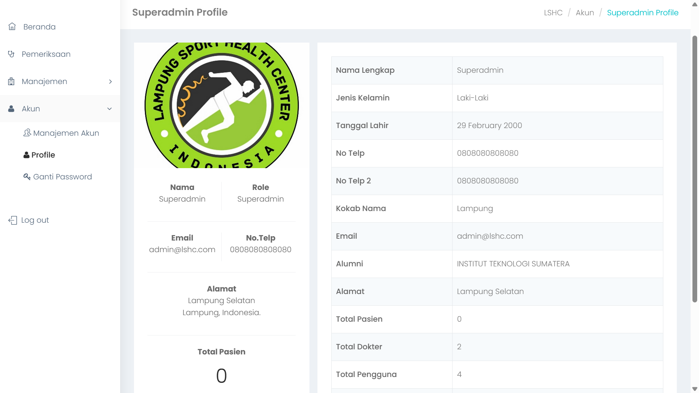
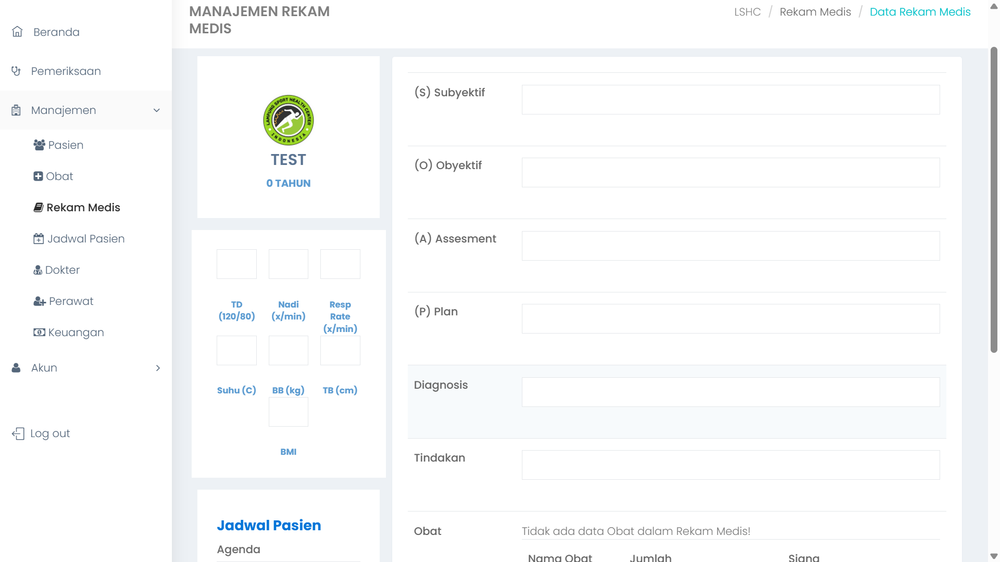

# Laravel Klinik Management System

## Deskripsi
Proyek ini adalah sistem manajemen klinik berbasis web yang dibangun menggunakan Laravel. Aplikasi ini mencakup fitur pengelolaan pasien, jadwal, rekam medis, obat, dokter, perawat, dan keuangan.

## Fitur Utama
- Autentikasi pengguna (login/logout)
- Manajemen pasien (pendaftaran baru & lama)
- Pemeriksaan pasien
- Manajemen rekam medis
- Manajemen obat
- Manajemen jadwal pasien
- Manajemen dokter dan perawat
- Pengelolaan akun dan ganti password
- Pengelolaan keuangan

## Instalasi

1. Clone repository ini:
    ```bash
    https://github.com/defanggaabypn/rekammedis
    cd <rekammedis>
    ```

2. Install dependensi Laravel:
    ```bash
    composer install
    ```

3. Buat file `.env`:
    ```bash
    cp .env.example .env
    ```

4. Generate application key:
    ```bash
    php artisan key:generate
    ```

5. Setup database di `.env`:
    ```env
    DB_DATABASE=nama_database
    DB_USERNAME=user_database
    DB_PASSWORD=password_database
    ```

6. Jalankan migrasi database:
    ```bash
    php artisan migrate
    ```

7. Jalankan server lokal:
    ```bash
    php artisan serve
    ```

## Struktur Proyek

- **composer.json:** Konfigurasi dependensi dan skrip composer.
- **routes/web.php:** Rute untuk fitur-fitur utama aplikasi.
- **app/Http/Controllers:** Folder untuk controller manajemen data klinik.

## Rute Penting

- `/login`: Halaman login
- `/dashboard`: Dashboard utama
- `/pendaftaran`: Pendaftaran pasien
- `/pemeriksaan`: Pemeriksaan pasien
- `/manajemen/rekam-medis`: Manajemen rekam medis
- `/manajemen/obat`: Manajemen obat
- `/manajemen/dokter`: Manajemen dokter
- `/manajemen/perawat`: Manajemen perawat
- `/manajemen/keuangan`: Manajemen keuangan
- `/manajemen/akun/ganti-password`: Ganti password

## Middleware

- **auth:** Untuk memastikan user sudah login
- **olah_pasien:** Hak akses khusus pendaftaran
- **olah_rekmed:** Hak akses rekam medis
- **olah_obat:** Hak akses manajemen obat
- **olah_keuangan:** Hak akses manajemen keuangan
- **superadmin:** Hak akses admin utama

## Tampilan Aplikasi
  
  


## Dependencies

- Laravel 8.12
- PHP ^7.3|^8.0
- Spatie Laravel Permission
- Doctrine DBAL
- GuzzleHTTP
- Laravel Debugbar
- FakerPHP
- PHPUnit

## Credits
- Dibangun menggunakan Laravel Framework
- Defangga Aby Vonega - Project Manager
- Ackyra Sibarani - Backend Developer
- Aminudin Fadilla - QA and Frontend Developer
- Muhammad Afif - UI/UX
- Nazla - Database Administrator

## Lisensi
Proyek ini menggunakan lisensi MIT.

---

Siap untuk dikembangkan lebih lanjut! 🚀